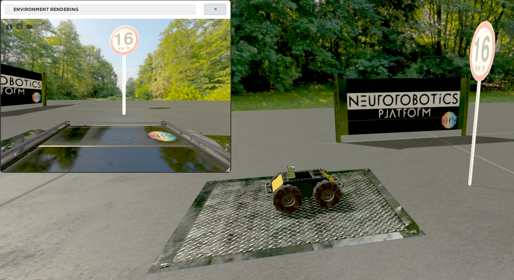

# NRP-Traffic-Sign-Detection-for-Autonomous-Driving
Semester Project in Cognitive Systems SS2018

## Objective
Create a Street Model in the NRP and let a Car pass street signs that can be 
recognized automatically (e.g. letting the car adjust its speed)

## Prerequisites
* [Neurorobotics Platform](https://neurorobotics.net/local_install.html)
* [Tensorflow Object detection API](https://github.com/tensorflow/models/tree/master/research/object_detection)

## Milestones
- [ ] Asset preparation and import to NRP (traffic signs, road)
- [ ] Environment setup in NRP (street, car, signs)
- [ ] Car logic, reaction to signs
- [ ] Dataset preparation and CNN training
- [ ] Environment setup in NRP, path planning of cars

